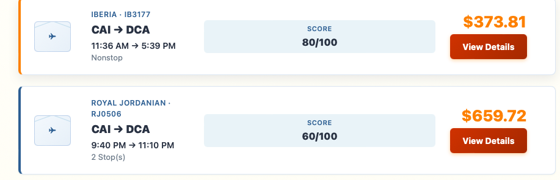
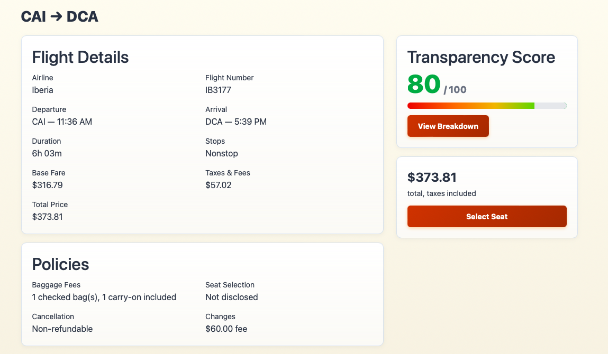
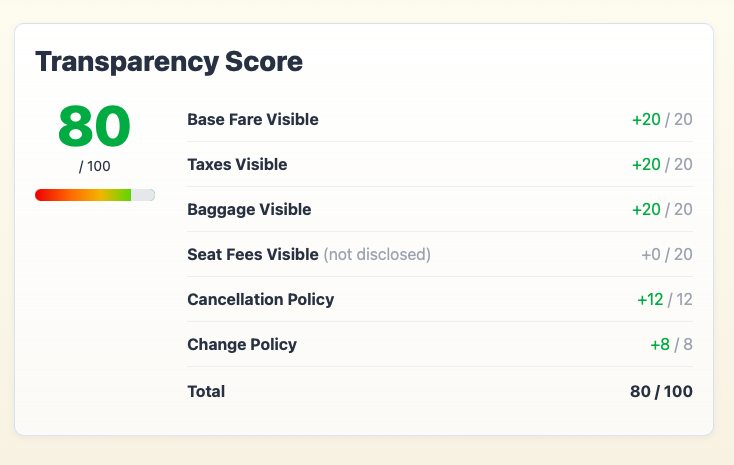
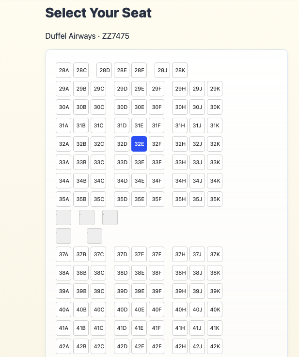

# AllFlightGo ✈️

A flight search and booking web app built for CSE 325 (Team 16). The twist that
makes it *ours* is the **Transparency Score** — every flight gets a 0–100 rating
(shown on a red→green gradient) so travelers can see how upfront an airline is
about fees, seat costs, and change/cancellation rules before they book.

**Live site:** https://allflightgo.onrender.com

---

## See it in action

A quick walkthrough of the booking journey, from search to seat.

### 1. Search results, ranked by transparency

Every flight is scored 0–100 and sorted so the most upfront airlines rise to the
top. The score sits right next to the price, so you can weigh *cost* against
*honesty* at a glance.



### 2. Flight details

Open a flight to see the full picture — fares, taxes, duration, and the real
policies (baggage, cancellation, change fees). Anything the airline *doesn't*
disclose is clearly marked "Not disclosed" instead of hidden.



### 3. Transparency Score breakdown

No black boxes: the breakdown shows exactly how the score was earned, point by
point. Here the flight loses 20 points because seat fees weren't disclosed —
which is precisely what the score is designed to surface.



### 4. Pick your seat

Choose a seat from a real, live seat map pulled straight from the Duffel API,
then review and confirm your booking.



---

## What it does

- **Search real flights** — live results from the [Duffel](https://duffel.com) API,
  with worldwide airport/city autocomplete as you type.
- **Transparency Score** — each flight is scored on fee clarity, refundability,
  seat/baggage transparency, etc. The score shows on a red-to-green gradient bar,
  and a **breakdown page** explains how it was calculated.
- **Filter & sort results** — by best score, price (low/high), or shortest trip,
  plus filters for max price, number of stops, and airline. Results are paginated.
- **Book a flight** — pick a seat from a real seat map (also from Duffel), review
  the booking, and confirm it.
- **Google sign-in** — log in with your Google account; we save your name and photo.
- **Profile page** — your bookings, stats, and a little rewards section.
- **My Bookings** — view and cancel your trips.
- **Admin dashboard** — a separate, password-protected staff area to manage the
  data (see below).

## Admin area

Staff sign in at **`/admin/login`** (this is *separate* from the Google login so
the two don't interfere). Admins get:

- A **dashboard** with stat cards (total flights, bookings, users, revenue).
- **Manage Flights** — add / edit / delete flights, with validation (airport codes
  must be 3 letters, arrival must be after departure, price must be above $0, etc.).
- **Manage Bookings** — view every booking across all users, and cancel or delete.

Access is gated by an `IsAdmin` flag on the user account. A small claims factory
turns that flag into an `Admin` role, and every `/admin` page requires it, so
regular users can't reach the admin area (the Admin nav link is hidden from them
too). See `RENDER_SETUP.md` for the admin credentials setup on the live server.

## Accessibility (WCAG 2.1 AA)

We did a full accessibility pass so the app is usable by everyone and meets the
project's WCAG 2.1 Level AA requirement:

- **Color contrast** — buttons and links were darkened so white text passes the
  4.5:1 contrast ratio.
- **Keyboard navigation** — a visible orange focus ring on every interactive
  element, plus a "Skip to main content" link for keyboard users.
- **Screen readers** — all form inputs are tied to their labels (`for`/`id`),
  and we added ARIA attributes (`aria-current` on the nav, `aria-expanded` on the
  mobile menu, `aria-pressed` on toggle buttons, `role="alert"` on error messages,
  and real labels like "Seat 12A" on the seat map).
- **Responsive** — layouts work on desktop, tablet, and mobile (hamburger menu on
  small screens).

**How to test it:** run the app, open it in a Chromium browser (Chrome or Edge),
and use **Lighthouse** (DevTools → Lighthouse → Accessibility) plus the **WAVE**
and **axe DevTools** extensions. Aim for 95–100 / zero errors. Also do a
keyboard-only pass (Tab through everything) and check the responsive layouts.

---

## Tech stack

| Piece | What we used |
|-------|--------------|
| Framework | ASP.NET Core **Blazor Web App** (.NET 10), Interactive Server render mode |
| Auth | ASP.NET Core Identity + Google OAuth |
| Database | SQLite via Entity Framework Core |
| Flight/seat data | Duffel API (`DuffelService`) |
| Hosting | Docker container on Render.com |

### Project layout

```
Components/
  Layout/        MainLayout, nav, skip link
  Pages/         Home, Search, FlightDetails, SelectSeat, ReviewBooking,
                 BookingConfirmation, MyBookings, Profile, Login,
                 TransparencyBreakdown, ...
  Pages/Admin/   AdminLogin, AdminDashboard, AdminFlights, AdminBookings
  Shared/        SearchFlights (the reusable search box)
Services/        DuffelService, FlightService, TransparencyScoreCalculator,
                 SelectedFlightService, SeatMap, Booking, Flight,
                 AdminUserClaimsPrincipalFactory
Data/            ApplicationDbContext, ApplicationUser
wwwroot/         app.css and static assets
Program.cs       startup, auth wiring, admin seed
Dockerfile       container build for Render
```

---

## Running it locally

**Requirements:** .NET 10 SDK.

```bash
git clone https://github.com/BurdiApps/AllFlightGo.git
cd AllFlightGo
dotnet run --launch-profile https
```

Then open **https://localhost:7152**. (First run, if the browser complains about
the dev certificate, run `dotnet dev-certs https --trust` once.)

### Configuration / secrets

None of these are committed as real secrets:

- **Duffel API key** and **Google OAuth** client ID/secret are stored in
  per-machine user-secrets / environment variables, not in the repo.
- The **dev admin login** (`afgadmin@email.com` / `Admin123!`) lives in
  `appsettings.Development.json`. It's a **local dev seed only, not a real
  secret.** On the live server these come from environment variables instead —
  see `RENDER_SETUP.md`.
- The SQLite database file (`allflight.db`) is **not** tracked in git.

---

## Deploying to Render

See **[`RENDER_SETUP.md`](RENDER_SETUP.md)** for the full step-by-step, including
the environment variables the admin login needs and the note about SQLite being
temporary on Render.

---

## Team

Team 16 — CSE 325. Built by James (BurdiApps) and Godfrey (itzfrey).
</content>
</invoke>
